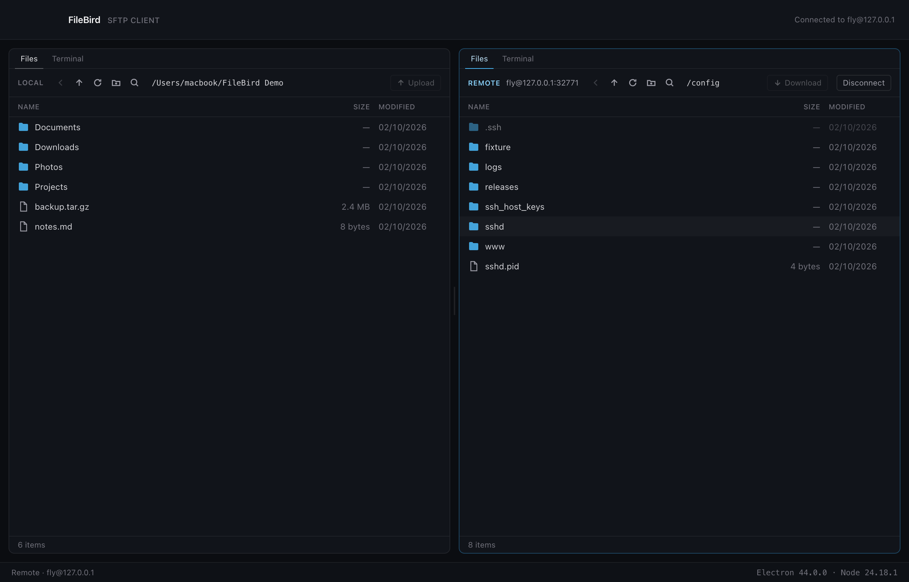
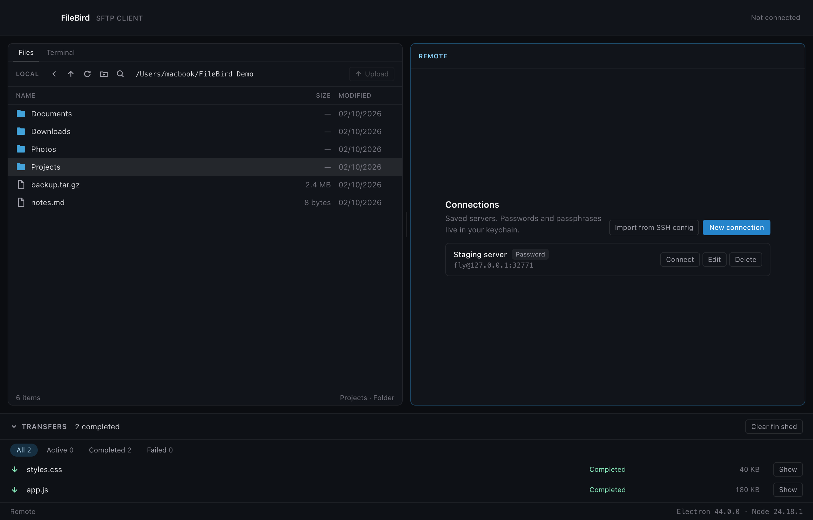
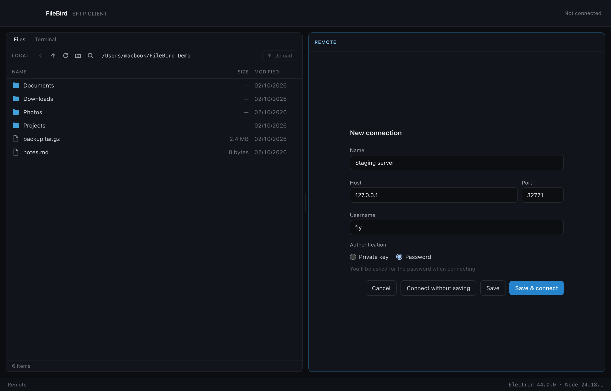
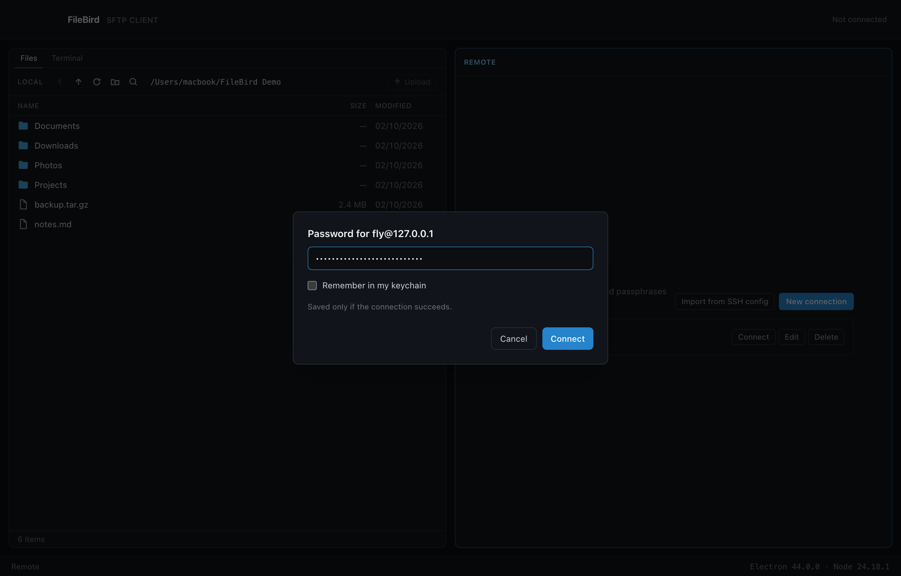
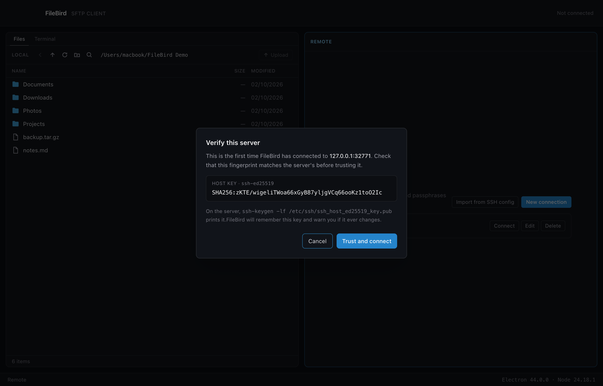
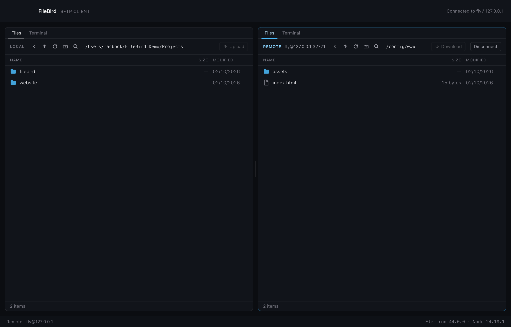
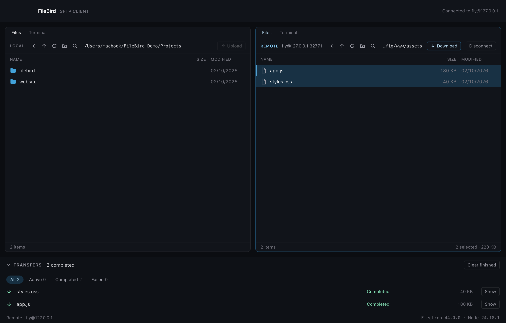
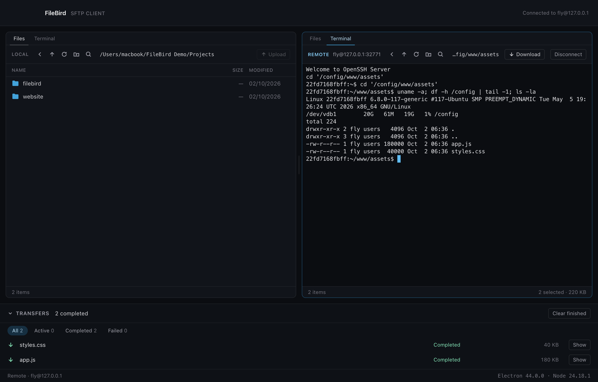
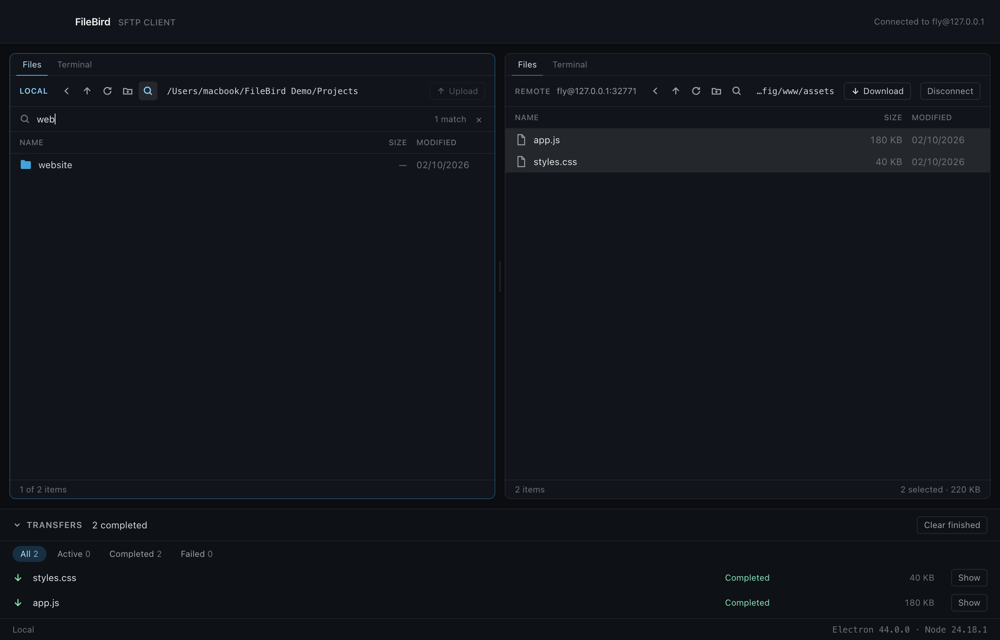
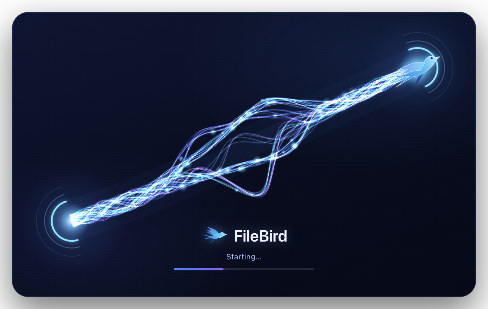

# FileBird

**A desktop SFTP client and SSH terminal in one window.** Two panes — your Mac on
the left, your server on the right — so you can move files by dragging them, and
run commands on the same connection without opening another app.

Built with Electron, React and TypeScript. macOS, Windows and Linux.



---

## What it does

| | |
|---|---|
| **Files on both sides** | Browse your computer and your server at once, in two independent panes with their own history, selection and status line. |
| **Transfers that behave** | Upload and download files and whole folders through a queue, with progress, speed, cancel and retry. Nothing is ever left half-written under a real filename. |
| **A real terminal** | A shell on the server, over the connection you are already using — no second login — and a shell on your own machine. `sudo`, `vim` and `top` all work. |
| **Drag and drop** | Between the panes to transfer; onto a folder in the same pane to move. |
| **Search** | Narrow any folder to the names you are looking for, on either side. |
| **Your keys stay yours** | Passwords and passphrases go to the system keychain, never to a file. Server keys are checked on every connection. |

---

## A tour

### Saved connections

Everything you connect to is listed, with the way you sign in. Connections can
also be imported from your `~/.ssh/config`.



### Adding a server

A name, a host, a user, and either a password or a private key. Keys are read
only when you connect, and FileBird tells you what it found in the file —
including whether it needs a passphrase.



### Signing in

Passwords and passphrases are asked for at connect time. Tick **Remember** and it
goes to your login Keychain — only after the server has accepted it.



### The server's identity, checked

The first time you reach a server, its key is shown before anything is trusted.
If a known server's key ever changes, FileBird refuses to connect and says so —
there is no "connect anyway".



### Browsing

Click a folder to open it. Back, up and refresh sit in each pane's toolbar, and a
folder that takes a moment to open says so rather than looking stuck.



### Transferring

Select what you want and press **Upload** or **Download**, or drag it to the
other pane. Each file is its own job, three run at once, and finished transfers
offer **Show** to open the file in Finder.



### The terminal

Each pane has a **Terminal** tab (`Cmd/Ctrl+\``). The remote one opens a shell on
the server over the connection that is already open; the local one opens a shell
on your own machine. Both start in the folder the pane is showing.



### Searching a folder

Press `Cmd/Ctrl+F` or click the magnifier, and the list narrows as you type.
The footer keeps count.



### Starting up



---

## Features in full

**Connections**
- Saved connections with password or private-key sign-in (`ed25519`, `rsa`, `ecdsa`).
- Passwords and passphrases are stored in the OS keychain — Keychain on macOS,
  Credential Manager on Windows, Secret Service on Linux — and only after the
  server accepts them.
- One-way import from `~/.ssh/config`, including `IdentityFile`. Hosts whose
  settings FileBird can't honour are listed with a warning instead of failing later.
- Host keys are trusted on first use, after you have seen the fingerprint. A
  changed key is a hard stop.

**Browsing**
- Two panes, each with its own history; the divider is remembered between runs.
- A click opens a folder; `Cmd`-click and `Shift`-click select several items.
- Hidden files are shown, dimmed. Symlinks are marked, and a broken one is obvious.
- Per-folder search (`Cmd/Ctrl+F`), on both sides.
- Keyboard: arrows, `Enter` to open, `Backspace` for the parent, `F5` to refresh.

**Transfers**
- Upload and download files and whole folder trees.
- A queue in the background: three files at a time, with progress, speed, cancel,
  and retry that reconnects if the server dropped.
- Conflicts are asked once for the whole batch: **Replace**, **Keep both** or **Skip**.
- Safe writes: each file lands under a hidden temporary name, is size-checked,
  then renamed into place, so an interrupted transfer never leaves a half-file
  under the real name.
- Downloads you didn't aim go to your **Downloads** folder; drag one to choose
  where instead.

**File management**
- New folder, rename, and delete on both sides.
- Local deletes go to the Trash (Recycle Bin on Windows). Remote deletes are
  permanent, asked about first, and never follow symlinks.
- Dragging onto a folder in the same pane **moves** items there — a rename, so
  nothing is copied and nothing is overwritten.
- Your home folder, its parents and the filesystem root are refused for delete,
  rename and move.

**Terminal**
- A shell per pane, as a tab beside the files.
- The remote shell is a second channel on the connection you already have: no
  second login, no second password, no second host-key question.
- A real pseudo-terminal, so interactive and full-screen programs work.
- Output is throttled rather than allowed to flood the window, and nothing a
  terminal shows is ever written to a log.

**Keyboard**

| | |
|---|---|
| `Cmd/Ctrl+1` / `Cmd/Ctrl+2` | Focus the local / remote pane |
| `Cmd/Ctrl+R` | Refresh |
| `Cmd+[` / `Alt+Left` | Back |
| `Cmd+↑` / `Alt+Up` | Parent folder |
| `Cmd/Ctrl+T` | Transfer the selection to the other side |
| `Cmd/Ctrl+F` | Search this folder |
| `Cmd/Ctrl+\`` | Switch between Files and Terminal |
| `Cmd/Ctrl+Shift+N` | New folder |
| `F2` | Rename |
| `Delete` / `Cmd+Backspace` | Delete |
| `Cmd/Ctrl+A` | Select all |

---

## Installing

Builds are made locally with electron-builder (see [Packaging](#packaging)). They
are **not signed with a developer certificate or notarised**, so each operating
system warns the first time you open FileBird.

### macOS

FileBird needs macOS 13 (Ventura) or later. `FileBird-<version>-mac-universal.dmg`
runs on both Apple Silicon and Intel; the `-arm64` / `-x64` DMGs are smaller
single-CPU builds.

1. Open the DMG and drag **FileBird** to **Applications**. The DMG also contains
   **How to install FileBird.txt** with these steps.
2. Double-click FileBird. The first time, macOS says it could not verify it: click
   **Done**.
3. Open **System Settings → Privacy & Security**, scroll to **Security**, click
   **Open Anyway** next to FileBird, and confirm. This is needed only once.
   On macOS 14 or earlier, right-click FileBird → **Open** → **Open** does the same.
4. If macOS says the app "is damaged", run
   `xattr -dr com.apple.quarantine /Applications/FileBird.app` once.
5. Saved passwords and passphrases go to your login Keychain, under **Fly**, the
   app's original name.

### Windows

Run `FileBird-<version>-win-x64-setup.exe`. SmartScreen warns about an
unrecognised app: choose **More info → Run anyway**. Credentials are stored in
Windows Credential Manager. *(Cross-built on macOS and not yet tested on Windows.)*

### Linux

```bash
chmod +x FileBird-<version>-linux-x86_64.AppImage
./FileBird-<version>-linux-x86_64.AppImage
```

Saving passwords needs a Secret Service provider (GNOME Keyring or KWallet).
AppImages need FUSE (`libfuse2` on Ubuntu 22.04+). *(Cross-built on macOS and not
yet tested on Linux.)*

---

## Security

- The window that draws the UI has no access to your filesystem, to Node or to
  the network. Everything it needs is requested through a small, hand-written
  bridge, one named method at a time, and every argument is checked again on the
  other side.
- Secrets live in the OS keychain only. They never reach the app's settings file,
  its log, or the part of the app that draws the screen.
- Private keys are read in the background process, when connecting. The UI only
  ever sees a summary: the type, the fingerprint, and whether it is encrypted.
- Host keys are always verified; a changed key stops the connection.
- Terminal output is never logged, because it routinely contains passwords and keys.
- The shipped app loads only its own files, with a content-security policy, and
  the Node features Electron offers are switched off in the build.
- Nothing is sent anywhere: no telemetry, no update pings, no accounts.

---

## Building from source

Requires **Node.js 22.12+** (`nvm use` picks the pinned version in `.nvmrc`).

```bash
nvm use
npm install
npm run dev        # Electron + Vite with hot reload
```

### Scripts

| Command | What it does |
|---|---|
| `npm run dev` | Development build with hot reload |
| `npm start` | Run the production build locally |
| `npm run build` | Typecheck, then build main, preload and renderer |
| `npm test` | Unit tests (Vitest) |
| `npm run test:integration` | Against a real OpenSSH server in a container |
| `npm run smoke` | End-to-end checks driving the built app |
| `npm run verify:package` | Checks a packaged build, including launching it |
| `npm run screenshots` | Regenerates the pictures in this README |
| `npm run test-server -- up` | A local SSH server to try the app against (`down` removes it) |

The integration, smoke and screenshot commands need Docker through Colima:

```bash
colima start fly
```

### Packaging

```bash
npm run build:mac      # DMGs (Apple Silicon + Intel) → release/
npm run build:win      # NSIS installer
npm run build:linux    # AppImage
```

macOS builds are ad-hoc signed only — never with a developer identity — and are
not notarised. Signing and publishing are deliberate, separate decisions.

---

## How it is built

```
Renderer (React, sandboxed)  ──bridge + IPC──>  Main process (files, SSH, terminals)
```

Everything that touches a disk, a network or a shell happens in the main
process. The renderer asks; it never reaches out itself.

- **SSH/SFTP:** `ssh2`, behind an interface so the app isn't welded to one library.
- **Terminal:** `xterm.js` in the window, a real pty (`node-pty`) or an SSH shell
  channel behind it.
- **Tests:** 452 unit tests, 67 integration tests against a real OpenSSH server,
  140 end-to-end checks driving the built app, and 17 checks on the packaged app.

---

## Known limitations

- Builds are unsigned and not notarised, so each OS warns once on first open.
- Windows and Linux builds are cross-built on a Mac and have not been run there.
- Moving files between two different disks on the same machine is refused (it
  would need a copy); transfer it through the other pane instead.
- One terminal per pane; no split view, and no searching the terminal's scrollback.
- Transfer history is kept in memory, so it is forgotten when the app closes.
- No SSH agent, `ProxyJump`, or FIDO keys yet. `~/.ssh/known_hosts` is not read;
  FileBird keeps its own list of trusted keys.

---

## Licence

MIT (see `package.json`). A `LICENSE` file has not been added yet.
